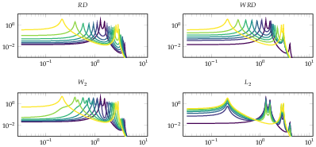
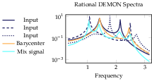

[](https://github.com/baggepinnen/SpectralDistances.jl/actions)
[](https://codecov.io/gh/baggepinnen/SpectralDistances.jl)
[](https://baggepinnen.github.io/SpectralDistances.jl/latest)

This repository implements all optimal-transport based distances between spectra detailed in the following pre print

["New Metrics Between Rational Spectra and their Connection to Optimal Transport", Bagge Carlson and Chitre 2020](http://arxiv.org/abs/2004.09152)

**Supplementary material** to the paper is provided in a [separate repository](https://github.com/baggepinnen/SpectralDistances_supplementary_material).

The package also contains a number of generic solvers for optimal transport problems:
- Fixed support in 1d (histograms)
- Varying discrete support (atoms/dirac masses) with non-uniform masses in any dimension
- Barycenters supported on fixed number of atoms, but possibly with non-uniform masses
- Barycentric coordinates
- Continuous support in 1d

See the [documentation](https://baggepinnen.github.io/SpectralDistances.jl/latest) for instructions.

### Installation
```julia
using Pkg
pkg"add SpectralDistances"
```


> Interpolation between two rational spectra under four different metrics.


> Barycenter of three spectra and mixed spectrum which can be decomposed into a combination of the three input spectra
